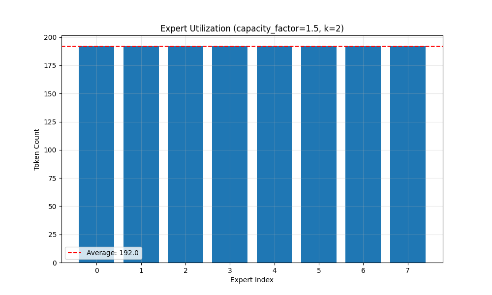
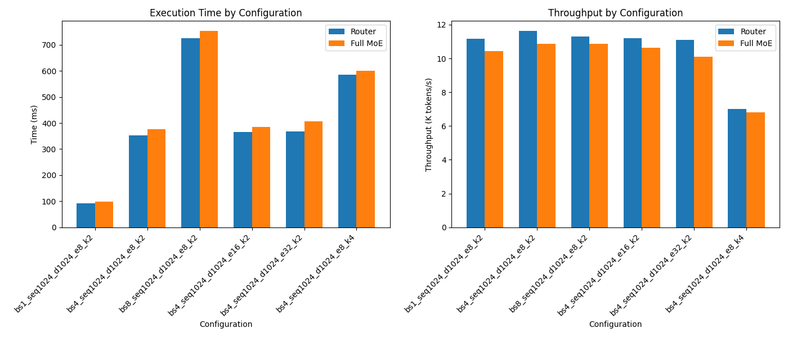
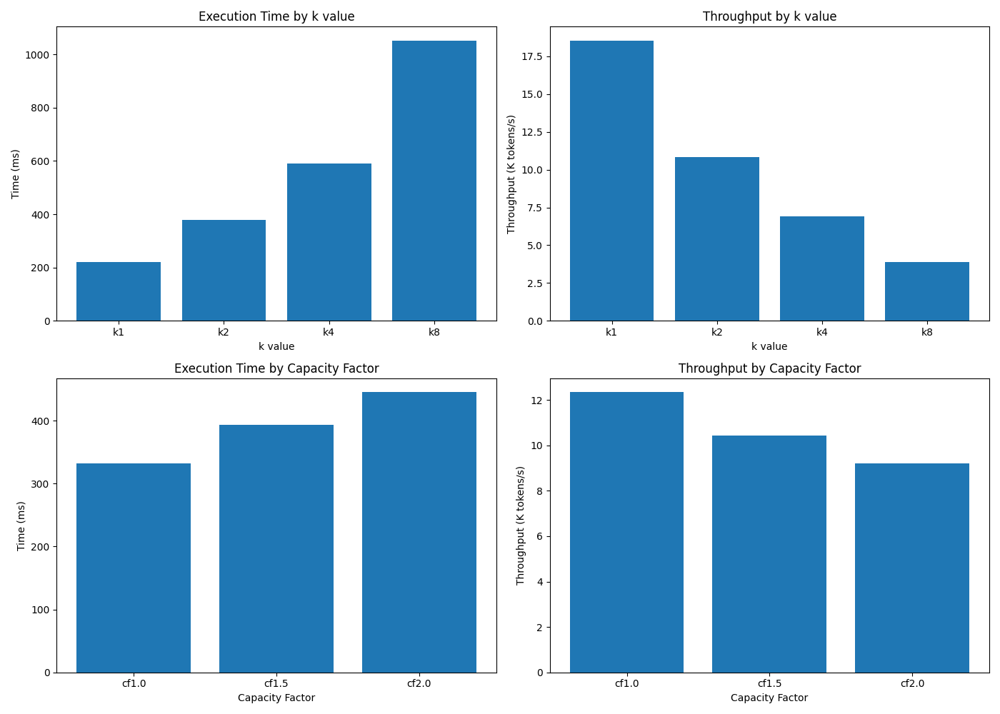

# Mixture of Experts (MoE) Implementation


This project implements a Mixture of Experts (MoE) model with a focus on efficient routing and expert utilization. The implementation includes:

1. A flexible MoE router that can handle different numbers of experts and routing parameters
2. Expert layers implemented as feed-forward networks
3. A complete MoE layer that combines routing and expert computation
4. A transformer block that uses MoE for the feed-forward layer
5. Comprehensive benchmarking and visualization utilities

## Project Structure

```
.
├── src/                    # Main source code
│   ├── models/            # Model implementations
│   ├── utils/             # Utility functions
│   └── triton/            # Triton optimizations
├── data/                  # Dataset and data processing
├── configs/               # Configuration files
├── docs/                  # Documentation
├── assets/                # Visualizations and diagrams
└── tests/                 # Test suite
```

## Key Features

- **Efficient Routing Algorithm**
  - Top-k expert selection
  - Capacity factor for load balancing
  - Optional router jitter for improved training
  - Sparse expert selection for computational efficiency

- **Expert Layers**
  - Configurable dimensions
  - Flexible activation functions
  - Batch processing support

- **Visualization and Analysis**
  - Expert utilization tracking
  - Performance benchmarking
  - Parameter comparison analysis
  - Memory usage profiling

## Results and Visualizations

### Expert Utilization

*Expert utilization patterns with k=2 and capacity factor=1.5*

### Performance Benchmarks

*Performance comparison across different configurations*

### Parameter Analysis

*Impact of different parameters on model performance*

## Installation

1. Create a virtual environment:
```bash
python -m venv venv
source venv/bin/activate  # On Linux/Mac
# or
.\venv\Scripts\activate  # On Windows
```

2. Install dependencies:
```bash
pip install -r requirements.txt
```

## Usage

### Running Benchmarks

```bash
python src/benchmark.py
```

This will:
1. Run comprehensive benchmarks with different configurations
2. Generate expert utilization plots
3. Create performance comparison charts
4. Save results in the `assets/` directory

### Visualization

The project includes several visualization tools:

1. **Expert Utilization Plotter**
   - Tracks expert selection patterns
   - Visualizes load balancing
   - Generates heatmaps of expert usage

2. **Performance Analyzer**
   - Creates comparative charts
   - Tracks memory usage
   - Analyzes computational efficiency

3. **Parameter Comparison Tool**
   - Compares different configurations
   - Visualizes trade-offs
   - Helps optimize hyperparameters

### Profiling

```bash
python src/profile_moe.py
```

This will:
1. Profile memory usage and performance
2. Generate detailed reports
3. Create visualization of bottlenecks
4. Update profiling documentation

## Project Roadmap

1. ✅ Core Implementation
   - ✅ Router implementation
   - ✅ Expert implementation
   - ✅ MoE layer implementation
   - ✅ Visualization tools

2. ✅ Evaluation Framework
   - ✅ Benchmarking utilities
   - ✅ Expert utilization analysis
   - ✅ Performance profiling
   - ✅ Visualization suite

3. 🔄 Advanced Features (In Progress)
   - 🔄 Memory optimization
   - 🔄 Quantization support
   - 🔄 Multi-GPU support
   - 🔄 Enhanced visualization tools

## Contributing

Contributions are welcome! Please feel free to submit issues and enhancement requests.

## License

This project is licensed under the MIT License - see the [LICENSE](LICENSE) file for details.
